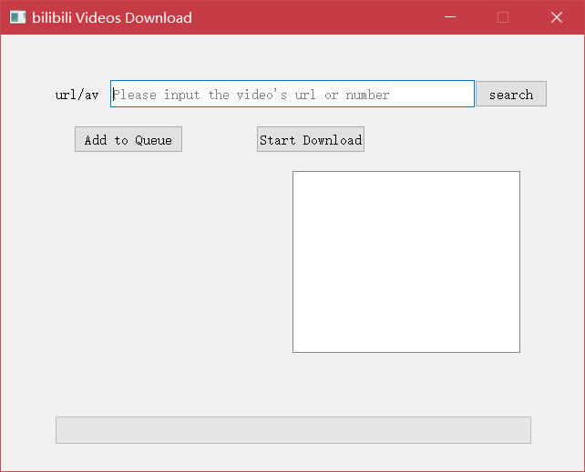

Bilibili(b站)视频下载 
===========================
   

|Author|Quanfita|
|---|---|
|Email|:hearts:1655037559@qq.com:hearts:

****
## 声明
### 软件均仅用于学习交流，请勿用于任何商业用途！感谢大家！
## 介绍
### 该项目为[Bilibili(b站)](https://www.bilibili.com/)视频下载的有界面版本
## 运行环境
Version: Python3
## 使用方法

### 安装依赖库

```
pip3 install -r requirements.txt
```
### 运行app.py文件




## 总结
> 欢迎大家一起学习交流，QQ群657701736


